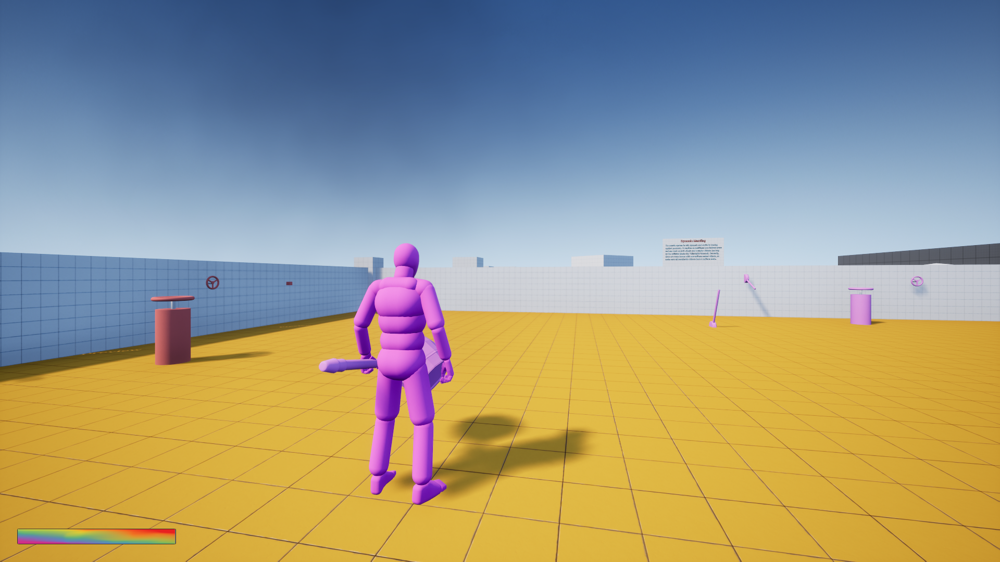

# Project Purple
Protyping a Game Jam project for our team on Unreal Engine using blueprints by implementing unique mechanics.

## Motivation
Developing a two character local game where the player controls both of them and solves puzzle based on the colors of the characters! 
See the project in action here => Soon..

## Screenshots

## License
[MIT](https://choosealicense.com/licenses/mit/)
